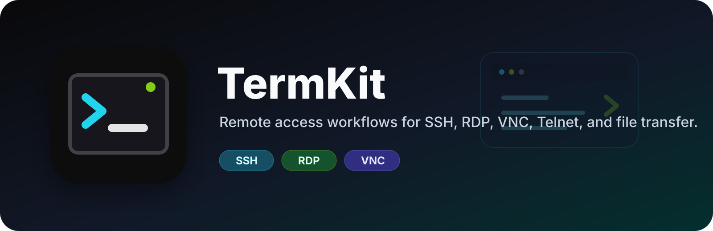
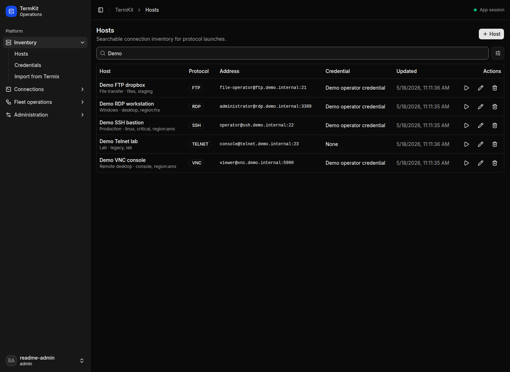
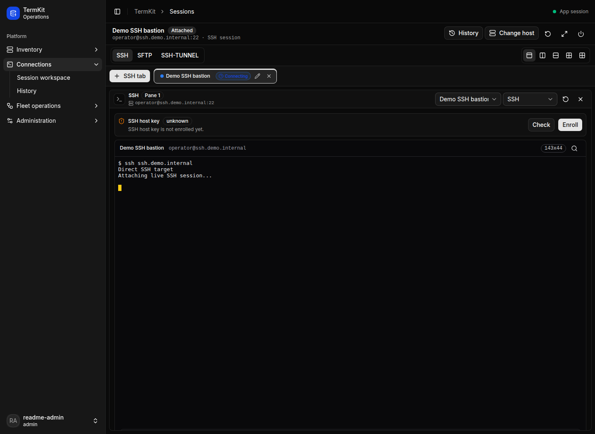
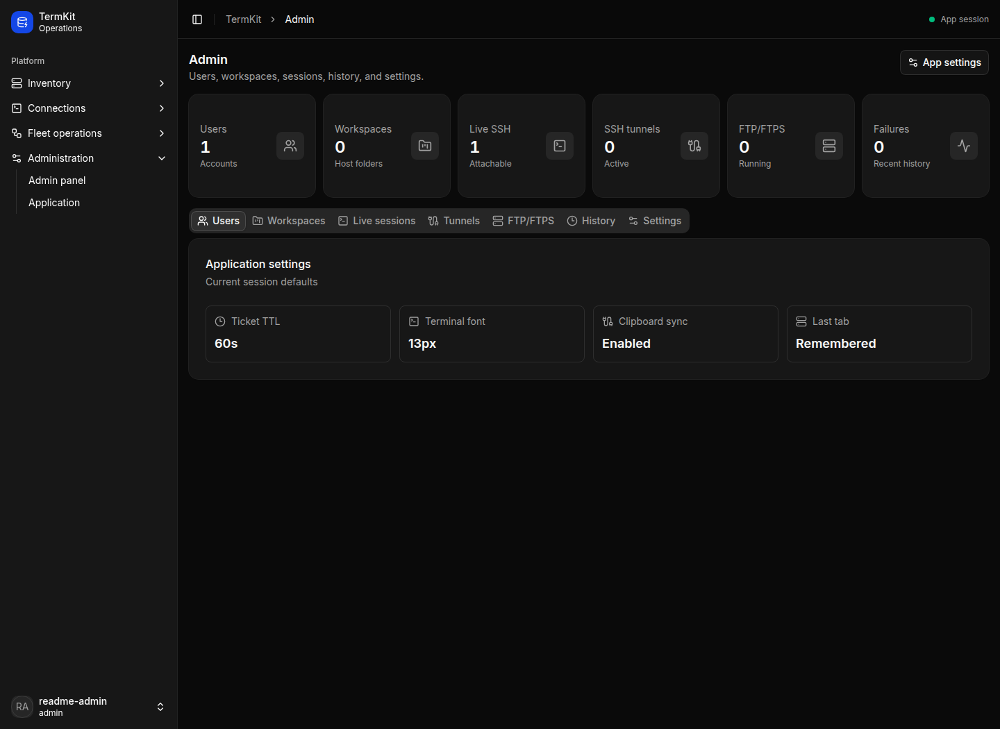

<p align="center">
  
</p>

<p align="center">
  <a href="https://github.com/jvz-devx/TermKit/actions/workflows/ci.yml"></a>
  <a href="https://github.com/jvz-devx/TermKit/actions/workflows/docker.yml"></a>
  
  <a href="./LICENSE"></a>
</p>

# TermKit

TermKit is a self-hosted remote access workspace for operators who need practical SSH, RDP, VNC, Telnet, SFTP, FTP, and FTPS workflows without scattering hosts, credentials, and launch history across separate tools.

It is built with SvelteKit, Postgres, checked-in Drizzle migrations, encrypted credential storage, Microsoft Entra sign-in support, and a Docker Compose deployment shape that exposes one public app port.

## Screenshots

<p>
  
  
</p>
<p>
  
</p>

## What It Does

- **Remote session workspace**: launch SSH, SFTP, RDP, VNC, Telnet, FTP, and FTPS sessions from one host inventory.
- **Encrypted credentials**: keep reusable credentials separate from hosts and avoid exposing saved secrets in the UI.
- **Live SSH tabs**: keep app-owned SSH sessions attachable across browser refreshes while the app process is running.
- **RDP through the app boundary**: proxy browser RDP traffic through the app to Devolutions Gateway so the gateway container stays internal.
- **Workspaces and history**: organize shared hosts and credentials, then review connection history by user, workspace, protocol, host, status, and date.
- **Invite-only Microsoft auth**: allow Microsoft Entra sign-in only for configured invited users or allowed domains, while local login remains available.
- **Fresh-server startup**: production startup runs checked-in database migrations before the app accepts traffic.

## Quick Start

Clone the repository and create a local environment file:

```sh
cp .env.example .env
```

Fill in the required secrets in `.env`, then start the full local stack:

```sh
docker compose up --build
```

The Compose stack publishes only the app port. Postgres is bound to loopback for local tooling, and Devolutions Gateway is reachable only inside the Compose network. Browser RDP traffic goes through the app at `/gateway`.

For SvelteKit development against local Postgres and Gateway services:

```sh
docker compose up -d postgres gateway
npm install
npm run dev
```

## Deployment

The Docker image is published as:

```txt
ghcr.io/jvz-devx/termkit
```

Supported tags are `main`, `latest`, the package version such as `1.0.0`, and the short commit SHA.

At minimum, production needs:

```sh
DATABASE_URL=postgres://...
ORIGIN=https://termkit.example.com
APP_SECRET=...
CREDENTIAL_MASTER_KEY=...
GATEWAY_URL=http://gateway:7171
GATEWAY_PUBLIC_URL=https://termkit.example.com/gateway
GATEWAY_PROVISIONER_KEY=...
```

Enable Microsoft Entra login only when the app registration and invite policy are ready:

```sh
MICROSOFT_AUTH_ENABLED=true
MICROSOFT_TENANT_ID=...
MICROSOFT_CLIENT_ID=...
MICROSOFT_CLIENT_SECRET=...
MICROSOFT_ALLOWED_DOMAINS=example.com
MICROSOFT_ADMIN_EMAILS=admin@example.com
```

Configure the Entra app registration as a web app with this redirect URI unless `MICROSOFT_REDIRECT_URI` is set:

```txt
https://termkit.example.com/auth/microsoft/callback
```

## Development

Useful commands:

```sh
npm run check
npm run lint
npm test
npm run build
npm run screenshots:readme
```

V7 test hardening and current coverage boundaries are tracked in
[docs/coverage-baseline.md](./docs/coverage-baseline.md).

Database commands:

```sh
npm run db:migrate
npm run db:generate
npm run db:studio
```

The README screenshots are generated from a deterministic local Playwright app run:

```sh
npm run screenshots:readme
```

To capture from an already running instance instead:

```sh
README_SCREENSHOT_BASE_URL=http://127.0.0.1:5173 npm run screenshots:readme
```

## Security

Do not commit real environment files, credentials, tokens, browser sessions, or protocol proof artifacts. See [SECURITY.md](./SECURITY.md) for vulnerability reporting.

## License

TermKit is released under the [MIT License](./LICENSE).
